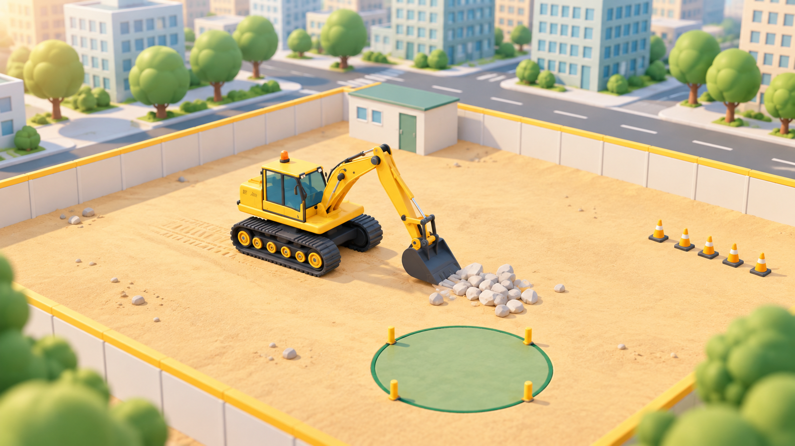
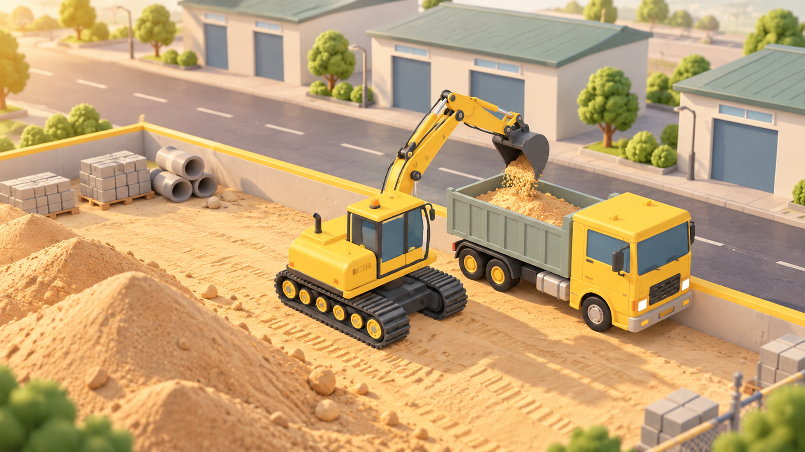
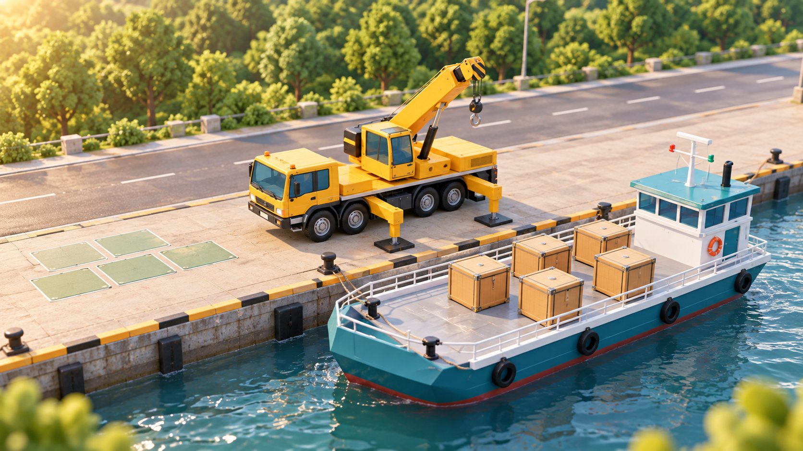
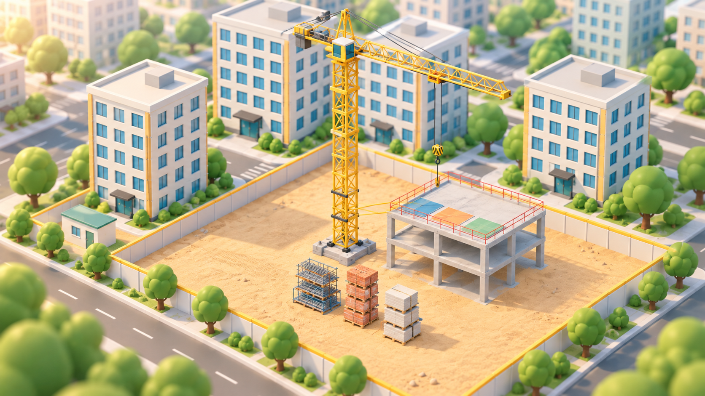

# Little Builders · Mechanical Exploration Yard

🌐 [中文](README.md) | [English](README-en.md)

A children's construction-machine game prototype built on Three.js, TypeScript, and Rapier. All mechanical models in this project are produced through Blender MCP.

## Scene Previews

| City Construction Site | Materials Yard |
| :---: | :---: |
|  |  |
| Riverside Crane Operation | Tower Construction |
|  |  |

## Getting Started

Dependencies are installed locally and verified with Node.js 24.

```powershell
npm.cmd install --cache .npm-cache
npm.cmd run dev -- --port 5173
```

Open http://127.0.0.1:5173. No account, backend, or API key required. Assets ship with the project — once dependencies are installed, the game runs without any external model service.

```powershell
npm.cmd run build
npm.cmd run preview
```

The production build is emitted to `dist/`. The physics module is loaded on demand; because Rapier ships WebAssembly inside its package, the single build chunk for it is still sizeable and Vite will surface a size warning. We have not run broad device performance testing yet.

## Implemented

- **Mechanical showroom**: orbit, zoom, and pan around the model; seven Chinese part labels with descriptions and highlights.
- **Controls**: hold-to-press mouse buttons and keyboard; chassis driving and steering, upper-structure swing, boom, arm, and bucket.
- **Bucket v2**: thin wedge front edge, thin teeth, continuous inlet and floor, with visual model and collider in sync. Inlet friction is 0.4 (the lower of the two contact values); bucket interior remains 0.85. Ground contact cuts off downward bucket motion without cancelling legal driving in the same frame, and the bucket cannot sink through the ground.
- **Linkage**: in-browser reconstruction of hydraulic-cylinder orientation and the bucket four-bar geometry; joint limits and basic obstruction checks against ground, walls, and the workshop shed.
- **City construction site**: buildings, a stadium, roads, greenery, walls, workshop shed, flattened ground, a rock pile, and a green target area. Ground rendering, physics collision, and machine walking height are unified at zero; bucket ground contact silently stops downward motion, with separate prompts for walls and the workshop shed.
- **Two independent scenes**: city site moves 8 rocks to the target; the materials yard digs a finite sand layer and dumps it over the wall into a dump truck to 80% capacity. The materials yard uses a low workshop building, roads, and a separate wall layout.
- **Physics**: 24 convex-hull rocks of varied shapes with gravity, collision, inertia, friction, sleeping, and CCD; a segmented concave bucket. Normal play never binds, snaps, or teleports rocks.
- **Judgment**: rocks are counted once they leave the bucket, enter the target area, approach the ground, and settle for 2 seconds. Leaving the target before completion deducts a rock; the completion event fires only once.
- **Feedback**: fireworks, celebration dialog, optional sound effects; reset/restart, return-to-showroom, and scene switching.
- **Input release**: stops on key/button release, contact cancel, leaving the button, and window blur; the simulation is frozen while the page is hidden and does not catch up a long timestep when it resumes.
- **Adaptive layout, button focus styling, keyboard-closeable dialog, and a reduced-motion preference.**

## Controls

| Action                       | Keys                |
| ---------------------------- | ------------------- |
| Forward / Reverse            | W / S               |
| Chassis turn left / right    | A / D               |
| Upper-structure swing L / R  | Q / E               |
| Boom raise / lower           | R / F               |
| Arm extend / retract         | T / G               |
| Bucket curl / dump           | Y / H               |

Every machine action can also be performed by holding the on-screen buttons on the right. Drag with the mouse to rotate the camera, scroll to zoom, right-drag to pan.

In the construction scene, click "Ground-level Scoop Assist"; once the status reads "Grounded", drive into the rock pile, then curl the bucket and raise the boom. Manually controlling the boom, arm, or bucket automatically disables the assist.

After positioning above the target, dump fully. If a rock does not slide out, lower the boom slightly to change the tilt angle. Rocks only count after they fall, roll, and come to rest.

"Restart" in the construction scene resets the machine, rocks, and the task together. Returning to the showroom or switching scenes also resets the current task.

## Verification

```powershell
npm.cmd test
# Start the dev server on port 5173 first, then run the browser and real-handling regressions:
npm.cmd run test:browser
# Real single-rock handling and independent full-load judgment fixtures for the sand yard:
npm.cmd run test:sand
```

The browser scripts default to the local standard Microsoft Edge install path; `e2e.mjs` accepts a `BROWSER_PATH` environment variable to point at another Chromium browser.

- 4 logic tests: stable counting, in-air / in-bucket exclusion, leaving-the-target deduction, and full-range linkage closure.
- Browser regressions: load, seven labels, hold/release, blur, driving, scene switching, return, celebration, continue-exploring, and a 390px narrow viewport; checks for browser exceptions and request errors.
- Real physical handling regression: uses the same machine controller and fixed physics step as the player, executing boom-down, drive-in, bucket-curl, boom-up, drive, swing, and dump, verifying at least 2 rocks delivered in a single pass. This test does not alter rock positions or task score.
- Flat ground and obstruction regression: walking along the previously uneven edge areas, approaching real walls, and attempting to keep pushing the bucket down — verifies normal walking has no obstruction, wall judgment stays tight against the wall face, and ground contact is not misreported as a wall.
- Assist-scoop regression: first-scene rock pile, 0° / ±15° / ±25° approach conditions, using the same drive-in, curl, and boom-up inputs, picking up 5–7 rocks per assembly; results recorded in `test-results/scoop-assist-results.json`. Browser tests additionally check button toggling and manual takeover; the collision regression checks that holding the bucket down still allows grounded forward motion. These results are regression evidence under fixed test conditions and do not guarantee pickup counts for arbitrary rock piles or poses. The second scene uses an independent sand-layer test; the old rock-pile assist does not apply.
- Fireworks test uses a dedicated free-fall rock fixture, releasing 8 dynamic rocks above the target to verify real ground-landing judgment and the celebration UI. It does not represent a full task being completed by a human via the keyboard.

Generated screenshots and test reports land in `test-results/` and are not under version control. `npm run build` also runs the TypeScript checker.

## Project Structure

- `src/main.ts`: application state, input, camera, fixed timestep, and fireworks.
- `src/machine.ts`: model loading, joints, hydraulic / linkage coupling, and pose-based obstruction.
- `src/physics.ts`: Rapier world, machine collision proxies, rocks, and render interpolation.
- `src/environment.ts`: showroom, city construction site, and scene-resource release.
- `src/logic.mjs`: independently testable machine geometry and task rules.
- `src/ui.ts` / `src/style.css`: UI and responsive styling.
- `assets/excavator/`: Blender sources, GLB, model previews, joint configuration, and collision vertices.
- `scripts/model_excavator_*.py`: Blender model-generation scripts.
- `scripts/refine_bucket.py`: updates the v2 bucket on existing Blender source files and re-exports the GLB, colliders, and inlet config; `scripts/render_excavator_preview.py` re-imports the GLB and renders the preview.

## Current Limitations

Only the excavator is selectable — bulldozer and crane are explicitly marked as in preparation. The first scene's ground is fixed; the second scene allows digging and deforms the sand layer, using a mixed coarse-particle and finite-volume-mesh simulation. Track geometry does not yet have a rolling-walk animation. The chassis and work equipment are driven kinematically, not by full-machine dynamics — hydraulic loads, tipping under load, complete self-collision, and realistic track/soil contact are not simulated. The basic obstruction checks and the passing handling regressions do not substitute for arbitrary-pose engineering validation.

Detail on the machine and rocks is higher than the surrounding city; the city buildings are procedural placeholders. Audio is currently limited to action and completion cues — there is no engine, track, or hydraulic field recording.

`window.__builders` is only exposed in Vite dev mode for regression scripts; it is not included as a callable debug entry point in production builds.
